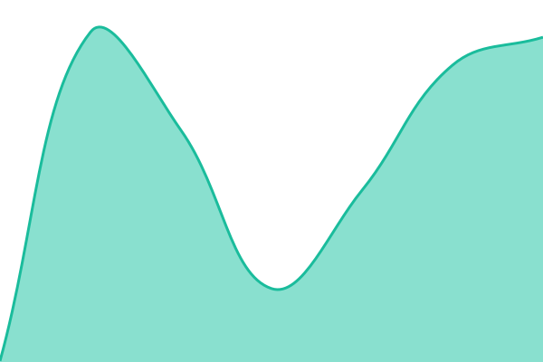
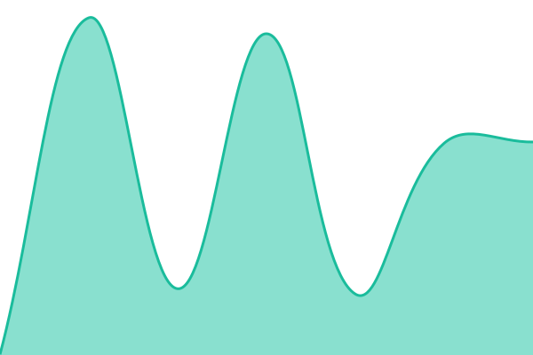
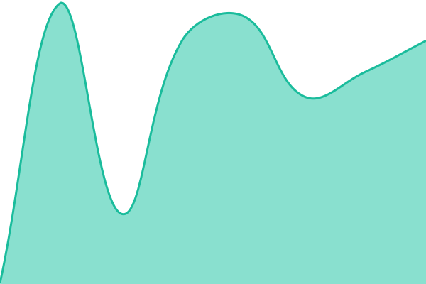
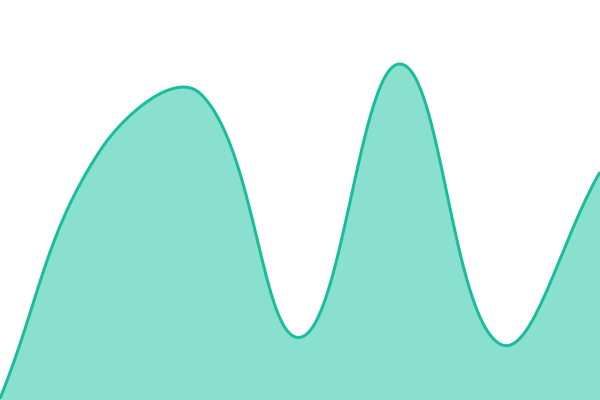

# [📈 Live Status](https://ZhangXavier.github.io/upptime): <!--live status--> **🟧 Partial outage**

This repository contains the open-source uptime monitor and status page for [Xavier](www.zxavier.com), powered by [Upptime](https://github.com/upptime/upptime).

With [Upptime](https://upptime.js.org), you can get your own unlimited and free uptime monitor and status page, powered entirely by a GitHub repository. We use [Issues](https://github.com/ZhangXavier/upptime/issues) as incident reports, [Actions](https://github.com/ZhangXavier/upptime/actions) as uptime monitors, and [Pages](https://ZhangXavier.github.io/upptime) for the status page.

<!--start: status pages-->
<!-- This summary is generated by Upptime (https://github.com/upptime/upptime) -->
<!-- Do not edit this manually, your changes will be overwritten -->
<!-- prettier-ignore -->
| URL | Status | History | Response Time | Uptime |
| --- | ------ | ------- | ------------- | ------ |
|  [Xavier's Blog](https://www.zxavier.com) | 🟩 Up | [xavier-s-blog.yml](https://github.com/z-xavier/upptime/commits/HEAD/history/xavier-s-blog.yml) | 

 175ms
     
 | 

<a href="https://z-xavier.github.io/upptime/history/xavier-s-blog">98.62%</a>
    

|  [Blinks](https://url.zxavier.com) | 🟩 Up | [blinks.yml](https://github.com/z-xavier/upptime/commits/HEAD/history/blinks.yml) | 

 2361ms
     
 | 

<a href="https://z-xavier.github.io/upptime/history/blinks">98.63%</a>
    

|  [Vaultwarden](https://bw.zxavier.com) | 🟩 Up | [vaultwarden.yml](https://github.com/z-xavier/upptime/commits/HEAD/history/vaultwarden.yml) | 

 156ms
     
 | 

<a href="https://z-xavier.github.io/upptime/history/vaultwarden">98.67%</a>
    

|  [Gitea](https://git.zxavier.com) | 🟩 Up | [gitea.yml](https://github.com/z-xavier/upptime/commits/HEAD/history/gitea.yml) | 

 339ms
     
 | 

<a href="https://z-xavier.github.io/upptime/history/gitea">98.72%</a>
    

|  [Lychee](https://image.zxavier.com) | 🟥 Down | [lychee.yml](https://github.com/z-xavier/upptime/commits/HEAD/history/lychee.yml) | 

 110ms
     
 | 

<a href="https://z-xavier.github.io/upptime/history/lychee">0.00%</a>
    

|  [Drive](https://drive.zxavier.com) | 🟥 Down | [drive.yml](https://github.com/z-xavier/upptime/commits/HEAD/history/drive.yml) | 

 126ms
     
 | 

<a href="https://z-xavier.github.io/upptime/history/drive">0.00%</a>
    

<!--end: status pages-->

[**Visit our status website →**](https://ZhangXavier.github.io/upptime)

## 📄 License

- Powered by: [Upptime](https://github.com/upptime/upptime)
- Code: [MIT](./LICENSE) © [Xavier](www.zxavier.com)
- Data in the `./history` directory: [Open Database License](https://opendatacommons.org/licenses/odbl/1-0/)
